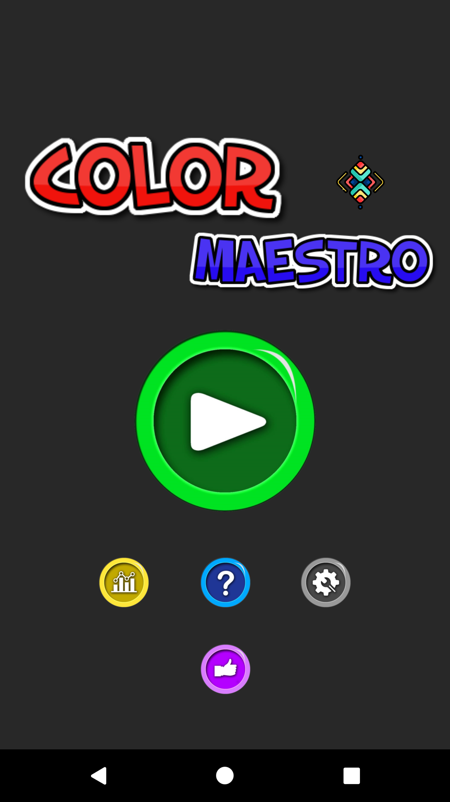
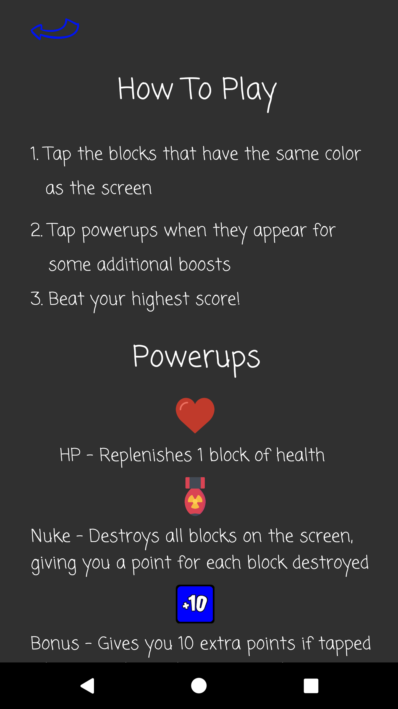
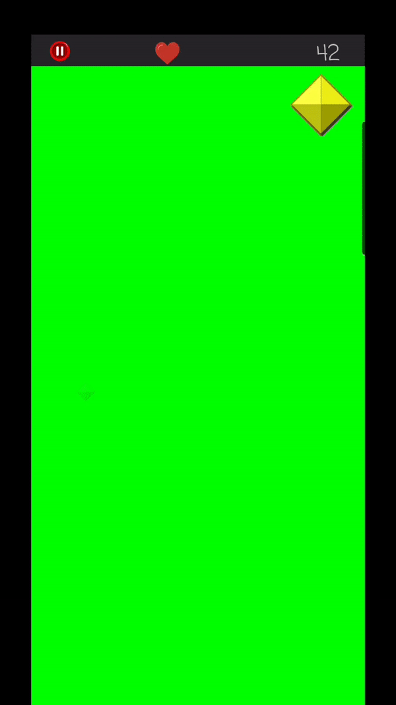
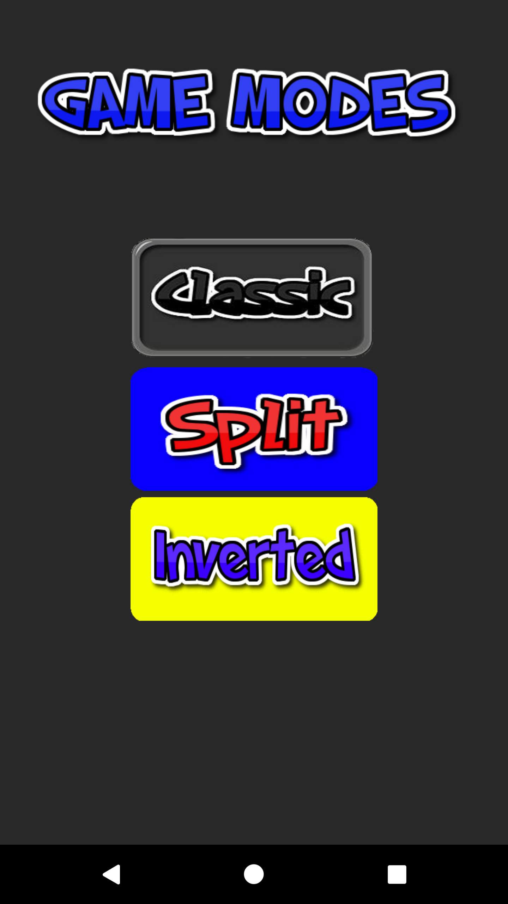
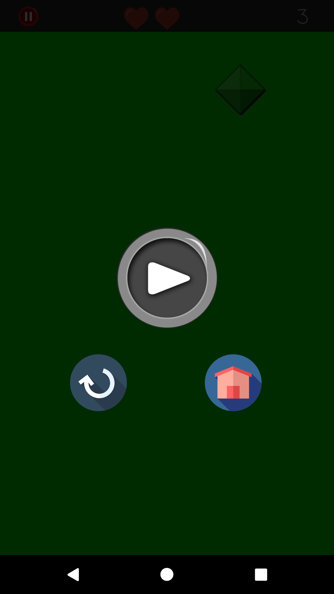
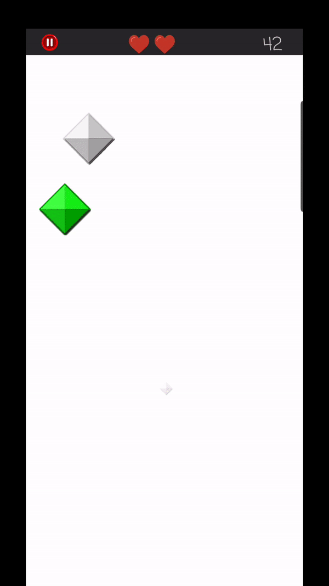
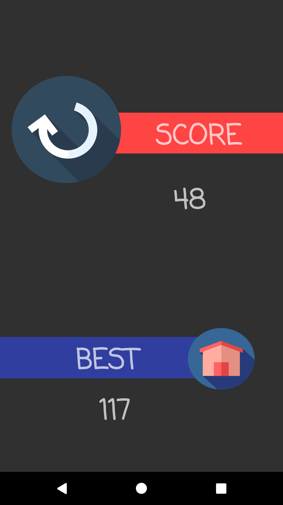
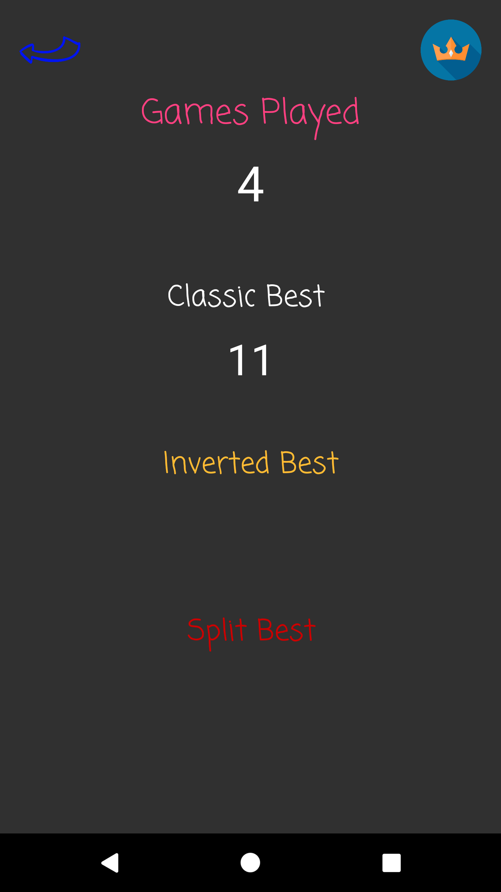

# ColorMaestro
Action mobile game I built a while back that requires the player to tap the gems whose color correspond to the screen's color, 
as the gems rush down the screen. Screen changes, powerups, and traps add to the fun. 

# Important Info
At the moment, only the Main screen has been fully refactored to follow MVP architecture
 
# Screens
  
  
 
  
 
